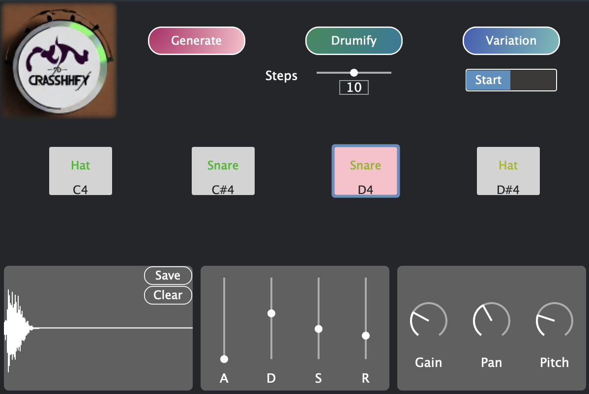

# CRASSHHFY
CRASSHHFY is a neural drum sampler plugin that uses a diffusion network to generate drum samples. Besides unconditional generation, the plugin also supports priming ("Drumify") and inpainting ("Variation"). Also, it has a classifier that can classify the drum samples into 3 categories: kick, snare, and hihat.

 It is based on the paper [CRASH: A Diffusion Network for Drum Sound Synthesis](https://arxiv.org/pdf/2106.07431.pdf) by Simon Rouard and Gaëtan Hadjeres and their original implementation [here](https://github.com/simonrouard/CRASH).

We have also added a classifier to the plugin which can classify the drum samples into 3 categories: kick, snare and hihat.

The 2 models used were exporting using [ONNX](https://onnx.ai/) and then converted to ORT format using [ONNX Runtime](https://onnxruntime.ai/docs/performance/model-optimizations/ort-format-models.html).

CRASSSHFY is available as a Standalone, AU, or VST plugin for Mac only. For other platforms, you can build from source.


<!--  -->

# Building from Source
To build from source, you must have CMake installed.
## Clone the repo

`git clone https://github.com/calgoheen/crasshhfy.git --recurse-submodules`

## Download the models
https://drive.google.com/file/d/1XIOoqXdSG2--scESA7fcVpZMYwt7tc_m/view?usp=share_link

Copy the files in the downloaded directory to `ort-builder`

Directory structure should look like
```
- crasshhfy
    - ort-builder
      - include
        - libs
            - macos-arm64_x86_64
                - onnxruntime.a
        - model
            - classifier.ort.c
            - classifier.ort.h
            - crash.ort.c
            - crash.ort.h
```

## Build the plugin
```
cmake -Bbuild -DCMAKE_BUILD_TYPE=Release
cmake --build build
```

# Compiling the models
If you'd like to export the models yourself, follow the steps below. The models are exported to ONNX format and then converted to ORT format using their tools.
## Clone CRASH
`git clone https://github.com/simonrouard/CRASH.git`
## Export the models
### Install requirements
```
python3 -m venv venv
source ./venv/bin/activate
pip install -r requirements.txt
pip install onnx
```
Then copy the `export.py` script from this repo to that one.
Then run
`python export.py`

This will create `crash.onnx` and `classifier.onnx`


## Build models
1. Create a directory to store the models inside `ort-builder`

    `mkdir ort-builder/onnx-models`

2. Then copy `crash.onnx` and `classifier.onnx` to `ort-builder/onnx-models`


3.
```
cd ort-builder
git clone https://github.com/microsoft/onnxruntime.git
python3 -m venv venv
source ./venv/bin/activate
pip install -r requirements.txt
pip install onnx
python -m onnxruntime.tools.convert_onnx_models_to_ort onnx-models --enable_type_reduction
python -m bin2c -o ./model/crash.ort onnx_models/crash.ort
python -m bin2c -o ./model/crash.ort onnx_models/classifier.ort
```
4. Update the build script (in our case `./build-mac.sh`) such that
`model.required_operators_and_types.config` becomes `required_operators_and_types.config` (2 places)

5. Run the build script (`./build-mac.sh`)
6. Ensure output looks the same as in "Download the models"

# Credits
- Simon Rouard and Gaëtan Hadjeres for the paper and their original implementation
- [Oli Larkin](https://github.com/olilarkin/ort-builder) for his ort-builder repo, tutorial, and examples
- [Sample rate converter](https://github.com/avaneev/r8brain-free-src) designed by Aleksey Vaneev of Voxengo
